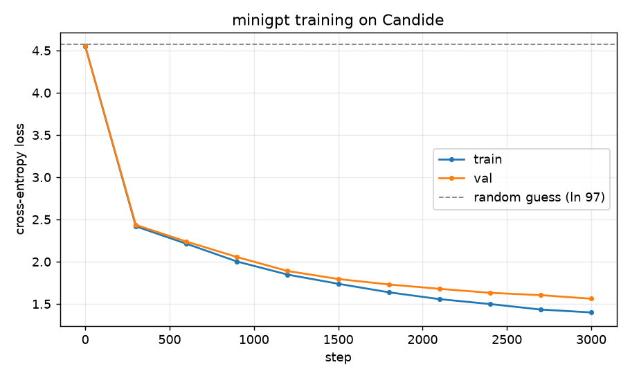
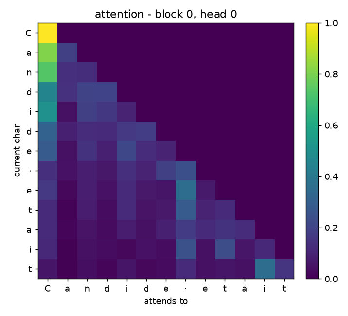

# minigpt

a small gpt (decoder-only transformer) i wrote from scratch in pytorch, mostly
to force myself to actually understand attention instead of importing it.

so there's no `nn.Transformer` and no `nn.MultiheadAttention` here - the whole
attention block is done by hand in [`model.py`](model.py). it's a char-level
model, trained on Voltaire's *Candide*, and it learns to spit out french in
roughly the same style.

```
minigpt/
├── model.py         # the gpt itself - attention, mlp, blocks, generate()
├── data.py          # char tokenizer + batching
├── prepare_data.py  # downloads the corpus and cleans it up
├── train.py         # training loop
├── sample.py        # generate text from a checkpoint
├── viz.py           # makes the two plots below
└── assets/          # the plots
```

## run it

```bash
python -m venv .venv && source .venv/bin/activate
pip install -r requirements.txt

python prepare_data.py        # -> data/corpus.txt
python train.py --steps 3000  # cpu, apple mps or cuda, picks automatically
python sample.py --prompt "Candide" --tokens 500
```

default model is ~0.8M params and trains in about a minute on an m-series mac.
nothing here needs a gpu farm, that's kind of the point.

## the loss

starts right around `ln(97) ≈ 4.57`, which is exactly what you'd get guessing
uniformly over the 97 characters, and drops from there as it figures out french
spelling, spacing and punctuation:



| step | train | val  |
|-----:|------:|-----:|
|    0 | 4.55  | 4.55 |
| 1200 | 1.85  | 1.89 |
| 2400 | 1.50  | 1.63 |
| 3000 | 1.40  | 1.56 |

## what attention actually does

this is the part i wanted to see for myself. below is the attention map from the
first head, first layer, on the string `Candide etait`. each row is a character
asking "which earlier characters matter to me?" - brighter = more weight.



notice the whole top-right triangle is dark / zero. that's the **causal mask**: a
character is literally not allowed to look at characters that come after it. that
single trick is what makes this a left-to-right language model - it can be
trained on the entire sequence at once without ever peeking at the answer.

## how the thing works, quickly

- **embeddings** - every char id becomes a vector, and every position gets its
  own vector too, then we add them. so the model knows *what* the char is and
  *where* it is.
- **attention** - for each char we make a query, a key and a value. the query
  dot-products against all the keys, softmax that, and use it to pull a weighted
  mix of the values. the `/ sqrt(head_dim)` is just to stop the softmax from
  saturating. we do this in several "heads" in parallel so different heads can
  learn different things.
- **causal mask** - set the future scores to -inf before the softmax (see plot
  above).
- **block** - `x = x + attn(norm(x))` then `x = x + mlp(norm(x))`, stacked a few
  times. residuals so the gradients survive going deep.
- **head** - a final linear layer gives one score per character, softmax = next
  char probabilities. the input embedding and this output layer share weights
  (weight tying), which is a standard gpt thing that saves params.

generation (`sample.py`) is just: predict next char, sample one, stick it on the
end, repeat.

## honest limitations

a 0.8M char-level model on ~200kb of text learns *form* way more than *meaning* -
it gets words, spacing, dialogue rhythm (`dit Candide`) and real names from the
book (*Cunégonde*), but it'll also invent words that don't exist. that's expected
at this size, and it keeps the focus on the architecture rather than scale. the
exact same code just gets bigger (`n_layer`, `n_embd`, more data) to become a
real gpt.

## license

code is mit. the training text is *Candide* by Voltaire, public domain (project
gutenberg).
